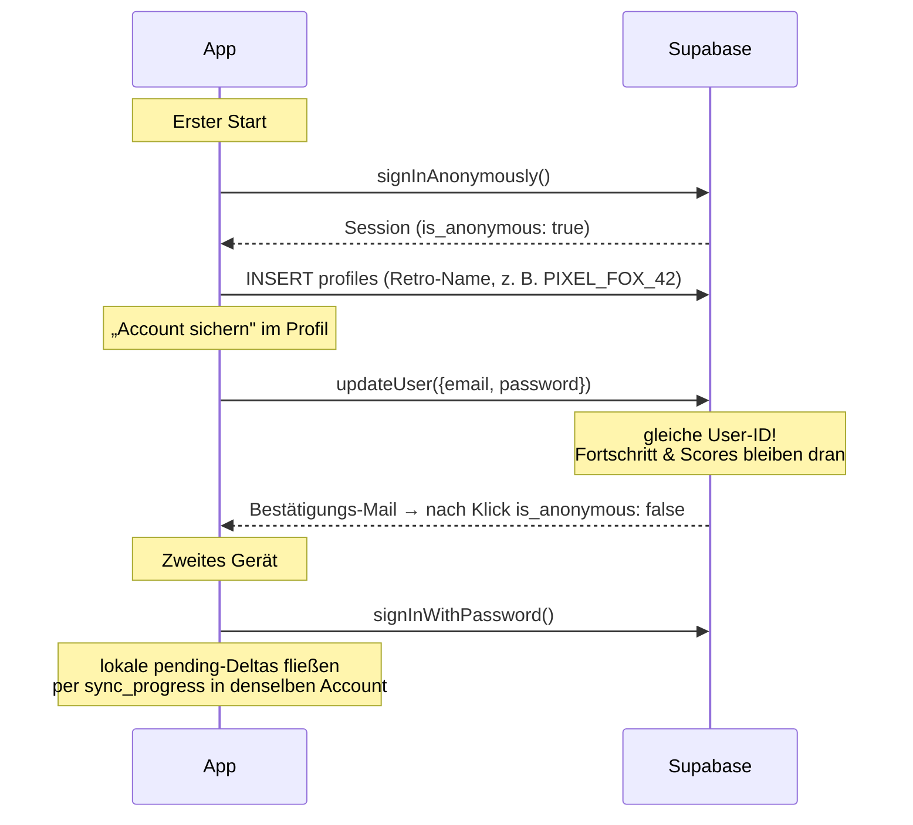

# Developer-Doku — GeoQuiz

Technische Gesamtübersicht: Architektur, Stack, Datenflüsse, Backend-Schema und wie man das Projekt erweitert. Für Setup/Loslegen siehe die [Haupt-README](../README.md), für die Planungshistorie [PLAN.md](PLAN.md), für den aktuellen Stand [STATUS.md](../STATUS.md).

---

## 1. Architekturprinzipien

Drei Entscheidungen prägen alles andere:

1. **Der Client ist die Quelle der Wahrheit fürs Gameplay.** Fragen werden client-seitig generiert, Scores client-seitig berechnet, Fortschritt client-seitig gezählt. Der Server validiert nur Plausibilität (Anti-Cheat-Trigger) — er spielt nicht mit. Dadurch läuft das Spiel vollständig offline.
2. **Statische Daten sind gebündeltes JSON, keine Datenbank.** Länder, Städte, Landmarks liegen als JSON im Bundle. Ein Content-Update ist ein Dateiaustausch + Deploy, keine Migration.
3. **Es gibt keinen eigenen Server-Code.** Das „Backend" ist ausschließlich SQL (Tabellen, Row Level Security, Postgres-Funktionen, Views) auf Supabase. Auth, REST-API und Connection-Handling liefert Supabase.

```
┌─────────────────────────────────────────────┐
│ Browser / (später) Capacitor-WebView        │
│                                             │
│  routes/ ──▶ components/QuizView            │
│                │                            │
│                ▼                            │
│  hooks/useQuizSession  (State-Machine)      │
│                │                            │
│     ┌──────────┼──────────────┐             │
│     ▼          ▼              ▼             │
│  quiz-engine  state/       api/             │
│  (pures TS)   (Zustand +   (supabase-js)    │
│               localStorage)   │             │
└───────────────────────────────┼─────────────┘
                                ▼
                     Supabase (Postgres + Auth)
                     nur: Auth, Leaderboard, Progress-Sync
```

---

## 2. Stack im Detail

| Baustein | Wahl | Warum |
|---|---|---|
| Build | Vite 8 (rolldown) + TypeScript 6 | Standard, schnell; `tsc -b` als Typecheck vor dem Build |
| UI | React **18** (bewusst gepinnt) | `react-simple-maps@3` hat Peer-Deps bis React 18 — Upgrade auf 19 erst, wenn die Map-Lib gewechselt/geforkt wird |
| State | Zustand 5 (+ `persist`-Middleware) | Zwei kleine Stores statt Redux-Zeremonie; localStorage-Persistenz ist eine Zeile |
| Routing | React Router 7, **HashRouter** | Hash-URLs funktionieren identisch auf statischem Hosting und im Capacitor-WebView — keine Server-Rewrites nötig |
| Umriss-Karte | react-simple-maps + world-atlas `countries-110m` | SVG, klein (~100 KB), reicht für „erkenne das Land"; höhere Auflösung würde den First Paint auf Mobilgeräten spürbar bremsen |
| Pin-Karte | Leaflet via react-leaflet 4 | Frei zoombare Rasterkarte für Distanz-Raten |
| Tiles | Carto `dark_nolabels` | **Ohne Ortsnamen** (sonst verrät die Karte die Antwort) und konform mit Nutzungsrichtlinien — der offizielle OSM-Tileserver ist für gebündelte Apps tabu |
| Fonts | @fontsource: Press Start 2P (Display) + VT323 (Fließtext) | Selbst gehostet → offlinefähig, kein Google-CDN |
| Backend | Supabase (Postgres + GoTrue-Auth + PostgREST) | Anonyme Auth eingebaut, RLS statt handgeschriebener Autorisierung, auto-generierte REST-API |
| Tests | Vitest | Läuft direkt gegen die pure-TS-Engine, kein DOM nötig |
| Lint | oxlint | Schnell, zero-config |

---

## 3. Die Quiz-Engine (`frontend/src/features/quiz-engine/`)

**Pures TypeScript ohne React-Import** — bewusst, damit sie ohne DOM testbar ist und theoretisch in einem Worker/Server wiederverwendbar wäre.

### Fragen & deterministische IDs

Es gibt zwei Fragetypen (`types.ts`):

- `ChoiceQuestion` — 4 Optionen, ein `correctIndex` (Flaggen, Hauptstädte, Länder, Umrisse)
- `PinQuestion` — Zielkoordinate + Falloff-Konstante (Städte-Pin, Landmark-Pin)

Jede Frage hat eine **deterministische ID** (`flag:DE`, `city-pin:city_paris_fr`). Das ist der zentrale Trick des Datenmodells: Fragen brauchen keine Datenbank-Tabelle — die ID ist gleichzeitig der Schlüssel für Fortschritts-Tracking (lokal und in `user_progress`). `questionFromId()` rekonstruiert aus einer ID die vollständige Frage (Roundtrip-getestet); so kann der Training-Modus aus gespeicherten Fortschritts-Schlüsseln wieder spielbare Fragen machen.

`questionGenerator.ts`:
- Fragenpool sind die **194 UN-Mitglieder mit Hauptstadt** (`quizPool()`), damit keine obskuren Territorien ohne Wiedererkennungswert auftauchen. Der volle 245er-Datensatz bleibt für Anzeigezwecke erhalten.
- Falsche Antworten kommen **bevorzugt aus derselben Region** (`pickDistractors`) — „Frankreich, Japan, Chile, Deutschland?" wäre zu leicht.
- Alle Zufallsentscheidungen laufen über ein injizierbares `Rng`-Interface → deterministische Tests.

### Scoring (`scoring.ts`)

```
Multiple Choice:
  time_bonus  = round(max(0, 50 · (1 − elapsed/limit)))     # limit = 8 s
  streak_mult = 1 + min(streak, 10) · 0.05                   # Kappung bei 1.5×
  score       = round((100 + time_bonus) · streak_mult)      # 0 bei falsch, Streak-Reset
  → max 225/Frage

Pin-Modi:
  distance_score = round(100 · e^(−km/R))                    # R = 200 (Städte), 90 (Landmarks)
  < 5 km  → Bullseye, fix 100
  final   = round(distance_score · 0.9 + min(10, 10·(1−elapsed/limit)))   # limit = 15 s
  → max 100/Frage; Präzision dominiert, Tempo ist Nebensache

Cup:
  total = round(100 · Σ score / Σ max_possible)              # normalisiert 0–100,
                                                             # fair trotz ungleicher Modi
```

Die Zahlenbeispiele aus der Planung (2000 ms/Streak 6 → 179; Distanztabelle 50 km→78, 200 km→37 …) sind als Testfälle in `scoring.test.ts` festgeschrieben — wer die Formel ändert, bricht bewusst einen Test.

### Adaptiver Sampler (`adaptiveSampler.ts`)

Kein SM-2/Anki (auf tägliche Reviews ausgelegt, passt nicht zu spontanen Spielsessions), sondern gewichtete Zufallsauswahl, pro Session neu berechnet:

```
error_weight   = 1 + 4 · (times_wrong / times_shown)          # [1, 5]
recency_weight = nie gesehen? 3.0 : min(1 + Tage·0.15, 4.0)   # [1, 4]
priority       = error_weight · recency_weight
```

Dazu: 30 % der Picks sind flat-random (Abwechslung), ein 5er-Ring-Buffer verhindert direkte Wiederholungen. Das Fragen-Universum des Training-Modus sind **alle** ~980 möglichen IDs über alle 6 Modi (`TrainingScreen.questionUniverse()`).

---

## 4. State, Persistenz & Sync

### Stores (`frontend/src/state/`)

- **`progressStore`** (Zustand + `persist` → localStorage-Key `geo-quiz-progress`):
  - `progressById` — Zähler pro Frage-ID (shown/wrong/correct/lastSeen)
  - `scores` — lokale Bestenliste (max. 50 Einträge)
  - `pending` — **unsynchronisierte Deltas** pro Frage-ID (die Offline-Queue)
- **`userStore`** (nicht persistiert): Online-Status, User-ID, Anzeigename, `isAnonymous`, E-Mail. Wird bei jedem App-Start aus der Supabase-Session neu aufgebaut.

### Warum Delta-Sync statt „Zustand hochladen"?

Zwei Geräte, die denselben (anonym→registrierten) Account nutzen, würden sich mit absoluten Werten gegenseitig überschreiben (last-write-wins). Stattdessen:

1. Jede Antwort erhöht lokal die Zähler **und** die `pending`-Deltas.
2. `flushProgress()` (bei App-Start und Session-Ende) macht einen Snapshot der Queue und schickt ihn als Batch an die Postgres-Funktion `sync_progress(jsonb)`.
3. Die Funktion macht pro Frage ein atomares `INSERT … ON CONFLICT … UPDATE SET times_shown = times_shown + delta` — Addition statt Überschreiben.
4. Erst bei Server-Erfolg werden die gesendeten Mengen von der Queue abgezogen (`consumePending`). Antworten, die *während* des Flushs eingehen, bleiben in der Queue (Snapshot-Semantik).

Scheitert der Flush (offline, kein Login), bleibt die Queue einfach in localStorage liegen — nichts geht verloren.

### Session-State-Machine (`hooks/useQuizSession.ts`)

Ein Hook für alle Modi: `question → feedback → next → … → done`. Er besitzt Score, Streak, Antworten-Log und ruft `recordAnswer` auf. Zwei nicht offensichtliche Details:

- **`answeredRef`-Lock:** Timer-Timeout und User-Klick können im selben Render-Zyklus feuern; der `phase`-State-Guard allein ist dann stale. Der Ref verhindert Doppel-Antworten (war ein echter, im Browser gefundener Bug).
- Choice-Feedback advanced automatisch nach 1,5 s; Pin-Feedback wartet auf „Weiter" (man will ja sehen, wo das Ziel lag).

---

## 5. Supabase-Backend (`supabase/migrations/`)

### Schema

| Tabelle | Zweck | Schreibweg |
|---|---|---|
| `profiles` | Anzeigename (1:1 zu `auth.users`) | Client-Insert/Update, RLS: nur eigene Zeile |
| `user_progress` | Zähler pro (User, Frage-ID) | **nur** über RPCs — keine Insert/Update-Policy für Clients |
| `score_entries` | Einzelergebnisse (Modus, Score, Dauer) | Client-Insert, RLS: nur eigene + nur registriert |
| `cup_runs` | Cup-Gesamtwertungen (Legs via `cup_run_id`-FK) | wie `score_entries` |

### Sicherheitsmodell (die Kurzfassung, die man kennen muss)

1. **RLS ist die Verteidigung, nicht der API-Key.** Der `anon`-Key ist bewusst im Client-Bundle — jede Tabelle hat Policies mit `auth.uid() = user_id`.
2. **Leaderboards laufen über Views mit Owner-Rechten** (`security_invoker = off`), die RLS gezielt umgehen, aber nur `display_name` + Score exponieren — nie `user_id` oder E-Mail.
3. **Das Registrierte-Accounts-Gate** (`0004`): Insert-Policies und Views prüfen `public.is_registered_user()` = `(auth.jwt()->>'is_anonymous')::boolean = false`. Gäste spielen frei, können aber weder Leaderboard schreiben noch lesen — serverseitig erzwungen, die UI-CTA ist nur Höflichkeit.
4. **Anti-Cheat light** (`0001`, Trigger `validate_score_entry`): verwirft Einträge mit < 400 ms/Frage oder `max_possible` über dem theoretischen Maximum. Ein modifizierter Client kann immer noch lügen — für ein Hobby-Leaderboard reicht Plausibilität.
5. **RPCs sind `SECURITY DEFINER`** mit eigener `auth.uid()`-Prüfung und Delta-Obergrenzen; `EXECUTE` ist nur `authenticated` gewährt.

### Auth-Flows



Migrations anwenden: siehe [supabase/README.md](../supabase/README.md) (SQL-Editor mit `apply_all.sql` oder Supabase-CLI). Dashboard-Voraussetzung: *Anonymous sign-ins* aktiviert.

### Offline-Degradierung

`supabaseClient.ts` exportiert `null`, wenn die Env-Variablen fehlen. Jede API-Funktion prüft das und gibt harmlose Fallbacks zurück (`false`/`null`) — das Spiel merkt davon nichts, der Header zeigt `○ OFFLINE`, die Global-Tabs zeigen den Account-Hinweis.

---

## 6. UI & Design-System

Alles in **einer Datei**: [`src/index.css`](../frontend/src/index.css). Kein UI-Framework, keine CSS-in-JS.

- **CSS-Variablen** als Design-Tokens: PICO-8-inspirierte Palette (`--green #00e756`, `--cyan #29adff`, `--yellow #ffec27`, `--red #ff004d` …) auf tiefem Space-Navy (`--bg #0d0b1e`); `--px: 4px` als Basis-Pixeleinheit für alle Borders/Shadows.
- **Pixel-Look-Rezepte:** harte Offset-Schatten (`box-shadow: 4px 4px 0 #000`) statt Blur; `:active` verschiebt den Button um genau den Schatten-Offset („eindrücken"); Animationen mit `steps()` statt weicher Easing-Kurven.
- **CRT-Effekt:** `.crt::before` legt Scanlines (repeating-linear-gradient), `.crt::after` eine Vignette über alles — `pointer-events: none`, rein dekorativ. Dazu ein animiertes Starfield.
- **Typo-Regel:** Press Start 2P nur für Headlines/Buttons/HUD in kleinen Größen (10–16 px, die Font ist riesig), VT323 für alles Lesbare (20–22 px).

Wiederverwendung: `QuizView` ist der einzige Quiz-Screen — Einzelmodi, Cup-Legs und Training rendern alle dieselbe Komponente mit unterschiedlichen Fragen-Arrays und `onDone`-Callbacks.

### Karten-Komponenten

- **`CountryOutline`** (Umriss-Modus): matcht das Ziel-Land über die **numerische ISO-Kennung** (`ccn3`) gegen die Topojson-Geometrie-IDs; Zoom-Heuristik nach Landesfläche (Russland 1.6× … Mikrostaaten 12×), Interaktion deaktiviert.
- **`MapPicker`** (Pin-Modi): Klick setzt den Pin, „Bestätigen" submittet (GeoGuessr-Muster) — Timeout submittet den zuletzt gesetzten Pin. Marker sind CSS-`divIcon`s (umgeht Leaflets Bundler-Icon-Problem *und* passt zum Pixel-Look). Im Feedback: Ziel-Marker, gestrichelte Linie, `fitBounds` auf beide Punkte.

---

## 7. Daten-Pipeline

```
mledoze/countries (Rohdatensatz, ODbL)
        │  frontend/scripts/transform-countries.mjs   ← node scripts/transform-countries.mjs
        ▼
src/data/countries.json   245 Länder, 84 KB (iso2/iso3/ccn3, Namen de/en, Hauptstadt,
                          Region, Zentroid, Grenzen, Fläche, unMember/independent).
                          `capital` ist mledoze's Rohwert (Englisch/lokal, z. B. "Vienna");
                          `capitalDe` ist der deutsche Name fürs UI (z. B. "Wien") — übernimmt
                          zuerst den kuratierten Namen aus cities.json (sofern dieselbe Stadt,
                          Bolivien/Südafrika mit mehreren Hauptstädten ausgenommen), sonst
                          `CAPITAL_DE_EXTRA` in transform-countries.mjs, sonst Fallback auf
                          `capital`. Bei neuen mledoze-Importen `capitalDe` gegenprüfen.
src/data/cities.json      141 Städte, handkuratiert (Population für Schwierigkeits-Tiers)
src/data/world-atlas-110m.json   Topojson für den Umriss-Modus (110m-Auflösung, ~100 KB —
                          deckt nur 177 Länder ab; 29 Mikrostaaten fehlen und werden im
                          Umriss-Pool über `outlineRenderableIso2`/`outlineDataBundle`
                          (src/data/index.ts) ausgeschlossen, bleiben aber bei
                          Flaggen/Hauptstädte/Länder normal spielbar)
```

Flaggen kommen **nicht** aus mledoze (dessen SVGs sind von der ODbL-Lizenz ausgenommen!), sondern aus dem MIT-lizenzierten `flag-icons`-Paket (CSS-Klassen `fi fi-de`).

```
scripts/landmarks-manifest.mjs   Quellliste: Wikipedia-Artikeltitel je Landmark/Ort
        │  frontend/scripts/fetch-landmark-images.mjs   ← node scripts/fetch-landmark-images.mjs
        ▼
src/data/landmarks.json   129 Einträge (Bauwerke, Monumente, Naturwunder, bekannte
                          Plätze/Straßen), Koordinaten + Bild automatisch per
                          Wikipedia-API verifiziert (nicht handgetippt)
public/landmarks/*.jpg    Bilder, lokal gebündelt (~8 MB gesamt), aus Wikipedia-
                          „Page Images" bzw. manuell kuratiertem Commons-Foto, wo der
                          Artikel nur eine Karte/Flagge als Titelbild hat
docs/IMAGE_CREDITS.md     Quellnachweis pro Bild (Artikel-Link, Lizenz siehe Artikel)
```

---

## 8. Tests & Verifikation

```bash
cd frontend && npm run test
```

Drei Test-Dateien, ~32 Tests:
- `scoring.test.ts` — die durchgerechneten Planbeispiele als Regressionsschutz
- `adaptiveSampler.test.ts` — Gewichtungs-Mathematik, statistisches Resurfacing (4000 Draws), Ring-Buffer, deterministische RNG-Injection
- `questionGenerator.test.ts` — Daten-Integrität (jede Stadt/Landmark referenziert ein existierendes Land, Berlin↔Paris-Haversine als Koordinaten-Plausibilität), Options-Eindeutigkeit, ID-Roundtrips

Konvention aus dem Plan: **Eine Phase gilt erst als fertig, wenn sie end-to-end spielbar ist** — nicht nur unit-getestet. Die manuellen Testprotokolle stehen in [STATUS.md](../STATUS.md).

---

## 9. Konventionen & Stolpersteine

- **`erasableSyntaxOnly`** ist im tsconfig aktiv: keine Parameter-Properties in Konstruktoren (`constructor(private x: T)` ist verboten), keine Enums. Felder explizit deklarieren und zuweisen.
- **React 18, nicht 19** — siehe Stack-Tabelle. Nicht „mal eben" upgraden.
- **`import.meta.env`** nur via `.env.local` (gitignored durch `*.local`); nach Env-Änderungen den Dev-Server neu starten, Vite liest Env nur beim Start.
- **Zustand-Updater müssen pur sein** (StrictMode double-invoke): kein `setB()` innerhalb eines `setA(updater)`.
- **Bundle-Warnung (~700 KB JS)** ist bekannt; Code-Splitting (Leaflet/Topojson lazy) steht unter Polish.
- **Training-Modus schreibt keine Score-Einträge** — Übung verzerrt keine Bestenliste; Fortschritts-Zähler laufen natürlich trotzdem.
- Git-Identität ist **repo-lokal** auf den privaten Account gesetzt; Remote läuft über den SSH-Alias `github-private` (siehe `~/.ssh/config`).

---

## 10. Kochbuch: typische Erweiterungen

### Neuen Multiple-Choice-Modus hinzufügen
1. `GameMode`-Union in `types.ts` erweitern
2. `questionGenerator.ts`: Prompt/Optionen in `buildChoice()` + Prefix in `deterministicId()` + Mapping in `questionFromId()`
3. `MODE_TITLES` in `PlayScreen.tsx`, Karte in `HomeScreen.tsx`, ggf. `CUP_MODES` in `cupSession.ts`
4. `mode`-CHECK-Constraint in einer neuen Migration erweitern (`score_entries`)
5. Tests: Options-Eindeutigkeit + ID-Roundtrip ergänzen

### Städte ergänzen
Eintrag in `cities.json` mit stabiler, sprechender ID (`city_<name>_<iso2>`). IDs **niemals ändern** — sie sind Fortschritts-Schlüssel in localStorage und `user_progress`.

### Landmarks/Orte ergänzen
`landmarks.json` wird generiert, nicht von Hand editiert. Eintrag in
`scripts/landmarks-manifest.mjs` ergänzen (id, Name, Land, Kategorie,
Difficulty, deutscher Wikipedia-Artikeltitel), dann
`node scripts/fetch-landmark-images.mjs` laufen lassen — holt Koordinaten +
Bild automatisch per Wikipedia-API und schreibt `landmarks.json` +
`public/landmarks/<id>.jpg` + `docs/IMAGE_CREDITS.md` neu. Schlägt der Titel
fehl (keine Koordinate/kein Bild, z. B. wenn das Artikelbild nur eine Karte
ist), meldet das Script das am Ende — Titel korrigieren oder Bild-URL in
`MANUAL_OVERRIDES` im Script eintragen. IDs **niemals ändern** — Fortschritts-Schlüssel.

### Schema ändern
Neue nummerierte Datei unter `supabase/migrations/`, anwenden (SQL-Editor oder CLI), dann `apply_all.sql` regenerieren:
```powershell
Get-ChildItem supabase/migrations -Filter *.sql | Sort-Object Name |
  ForEach-Object { "-- ===== $($_.Name) ====="; [IO.File]::ReadAllText($_.FullName); "" } |
  Set-Content supabase/apply_all.sql -Encoding utf8
```
Bestehende Migrationsdateien nie nachträglich editieren.

---

## 11. Deployment

**Der Normalfall — beides auf einmal:**

```powershell
npm run release
```

Läuft sowohl im Repo-Root als auch in `frontend/`: die Root-`package.json` ist eine reine Skript-Durchreiche (`cd frontend && …`), damit der naheliegende Aufruf nicht mit „package.json nicht gefunden" scheitert. Flags werden durchgereicht: `npm run release -- --no-deploy`.

`scripts/release.mjs` fährt Tests + Lint → Vite-Build → Cloudflare Pages → `cap sync` → Gradle `assembleRelease` + `bundleRelease`. Entscheidend: **derselbe** `dist/`-Build geht ins Web und in die App — so können die beiden nicht auseinanderlaufen (genau das war vorher die Falle, weil `npm run deploy` nur das Web anfasste). Die fertigen Artefakte landen mit sprechendem Namen in `frontend/release/` (gitignored), die Signatur wird per `apksigner` bestätigt.

| Befehl | Was passiert |
|---|---|
| `npm run release` | alles: Checks, Web-Deploy, signierte APK + AAB |
| `npm run release:web` | nur Cloudflare Pages |
| `npm run release:android` | nur die App (kein Upload) — baut `dist/` trotzdem neu |
| `npm run release -- --no-deploy` | alles bauen, nichts hochladen (Trockenlauf) |
| `npm run release -- --debug-apk` | zusätzlich die Debug-APK fürs schnelle Aufspielen |
| `npm run release -- --skip-checks` | ohne Tests/Lint — nur für Notfall-Redeploys |
| `npm run deploy` | Altbestand: Web-Build + Upload, ohne Checks und ohne App |

**Voraussetzungen Android:** `JAVA_HOME` + `ANDROID_HOME` gesetzt (ROADMAP B1) und `android/keystore.properties` für die Signierung (Vorlage: `keystore.properties.example`). Fehlt die Keystore-Datei, baut Gradle unsigniert weiter — das Skript warnt vorher deutlich, denn eine unsignierte APK lässt sich weder installieren noch hochladen.

**Stolperstein Versionsnummer:** `versionCode`/`versionName` stehen fest in `android/app/build.gradle` und werden **nicht** automatisch hochgezählt. Fürs Sideloading egal, für einen Play-Store-Upload muss `versionCode` vorher von Hand erhöht werden (sonst lehnt Google das Bundle ab).

**Web-Details:** `frontend/dist/` ist rein statisch (jeder Static-Host: Cloudflare Pages, Netlify, GitHub Pages …). Dank HashRouter keine Rewrite-Regeln nötig. Env-Variablen werden **zur Buildzeit** eingebacken — beim gewählten Direct-Upload-Flow kommen sie aus `frontend/.env.local`, bei einem Git-Flow bräuchte der Host `VITE_SUPABASE_URL`/`VITE_SUPABASE_ANON_KEY` als Build-Env.

**Reihenfolge bei Schema-Änderungen:** erst die Migration auf der Live-DB (`supabase/apply_pending.sql`), dann `npm run release`. Andersherum sieht die bereits ausgelieferte App eine DB, die ihre RPC-Signatur noch nicht kennt.
